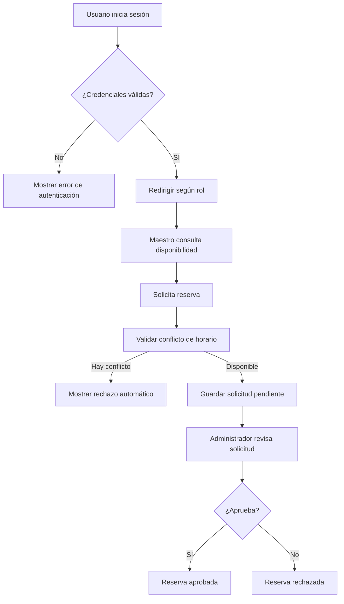

<div align="center">

# Aulas ICF
### Sistema web para la gestión y reserva de aulas del Instituto de Ciencias Físicas


**Proyecto académico enfocado en optimizar la administración, consulta de disponibilidad y reserva de aulas dentro del ICF-UNAM.**

</div>

***

## Tabla de contenido

- [Descripción](#descripción)
- [Objetivo](#objetivo)
- [Problema que resuelve](#problema-que-resuelve)
- [Características principales](#características-principales)
- [Módulos del sistema](#módulos-del-sistema)
- [Tecnologías utilizadas](#tecnologías-utilizadas)
- [Arquitectura general](#arquitectura-general)
- [Flujo principal](#flujo-principal)
- [Estructura sugerida del proyecto](#estructura-sugerida-del-proyecto)
- [Instalación y ejecución](#instalación-y-ejecución)
- [Despliegue en producción](#despliegue-en-producción)
- [Roles de usuario](#roles-de-usuario)
- [Reglas de negocio relevantes](#reglas-de-negocio-relevantes)
- [Pantallas consideradas](#pantallas-consideradas)
- [Roadmap](#roadmap)
- [Autor](#autor)

***

## Descripción

**Aulas ICF** es un sistema web diseñado para gestionar el proceso de reserva de aulas dentro del Instituto de Ciencias Físicas de la UNAM.

El sistema centraliza la consulta de disponibilidad, el registro de aulas, la administración de usuarios y la aprobación o rechazo de solicitudes, evitando conflictos de horario, duplicidad de reservas y procesos manuales poco eficientes.

***

## Objetivo

Desarrollar una plataforma web que permita al personal autorizado del ICF consultar, solicitar, administrar y controlar las reservaciones de aulas de forma rápida, segura y centralizada.

***

## Problema que resuelve

Actualmente, la gestión manual de aulas puede generar problemas como:

- Doble asignación de espacios.
- Falta de visibilidad sobre la disponibilidad real.
- Dificultad para dar seguimiento a solicitudes.
- Procesos administrativos lentos y dispersos.
- Falta de historial y trazabilidad de reservas.

**Aulas ICF** busca resolver estos problemas mediante una solución digital con control de acceso por roles, validación de conflictos y consulta en tiempo real.

***

## Características principales

- Inicio de sesión seguro con autenticación.
- Registro y administración de usuarios.
- Gestión de aulas disponibles.
- Solicitud de reservas por parte de maestros.
- Aprobación o rechazo de solicitudes por parte del administrador.
- Consulta de disponibilidad en calendario.
- Cancelación de reservas.
- Historial y seguimiento de movimientos.
- Notificaciones por correo electrónico.
- Validación para evitar conflictos de horario.

***

## Módulos del sistema

| Módulo | Descripción | Prioridad |
|---|---|---|
| **1. Autenticación y Gestión de Sesión** | Permite iniciar sesión, cerrar sesión y registrar usuarios. | Alta |
| **2. Gestión de Aulas** | Permite registrar y editar la información de las aulas disponibles. | Alta |
| **3. Gestión de Usuarios** | Permite editar y desactivar usuarios del sistema. | Media |
| **4. Reserva de Aulas** | Permite solicitar, cancelar, aprobar o rechazar reservas. | Alta |
| **5. Consulta de Disponibilidad** | Permite visualizar la disponibilidad de aulas por fecha y horario. | Alta |

***

## Tecnologías utilizadas

| Categoría | Tecnología | Uso dentro del proyecto |
|---|---|---|
| Frontend | **React** | Construcción de interfaces reutilizables e interactivas |
| Backend | **Spring Boot** | Desarrollo de la lógica del servidor y API REST |
| Base de datos | **MySQL** | Almacenamiento de usuarios, aulas y reservas |
| Seguridad | **JWT / Spring Security** | Autenticación y control de acceso |
| API | **REST** | Comunicación entre frontend y backend |
| Gestión del proyecto | **Scrum** | Organización del desarrollo por iteraciones |
| Correo | **Mail Sender** | Envío de notificaciones automáticas |

***

## Arquitectura general

```text
[ Usuario ]
    |
    v
[ Frontend - React ]
    |
    v
[ API REST - Spring Boot ]
    |
    v
[ Base de datos - MySQL ]
```

### Enfoque arquitectónico

- **Capa de presentación:** interfaz web para administradores y maestros.
- **Capa de negocio:** reglas de validación, reservas, autenticación y permisos.
- **Capa de persistencia:** almacenamiento de usuarios, aulas, solicitudes y estados.

***

## Flujo principal



***

## Estructura sugerida del proyecto

```bash
Aulas-ICF/
├── frontend/
│   ├── src/
│   ├── public/
│   └── package.json
├── backend/
│   ├── src/main/java/
│   ├── src/main/resources/
│   └── pom.xml
├── database/
│   └── aulas_icf.sql
├── docs/
│   ├── DFR.pdf
│   ├── marco-teorico.pdf
│   └── mockups/
└── README.md
```

***

## Instalación y ejecución

Toda la configuración sensible o dependiente del entorno (credenciales de base de datos,
secreto JWT, CORS, correo, etc.) vive fuera del código fuente, en variables de entorno.
**Nunca edites `application.properties` para poner credenciales reales** — usa un archivo
`.env` local (gitignoreado) o variables de entorno del sistema operativo.

### 1. Clonar el repositorio

```bash
git clone <url-del-repositorio>
cd Aulas_ICF
```

### 2. Configurar el backend

```bash
cd back/aulas
cp .env.example .env
# Edita .env: como mínimo, DB_USERNAME/DB_PASSWORD y JWT_SECRET.
```

Spring Boot carga `back/aulas/.env` automáticamente (vía `spring.config.import` en
`application.properties`) cuando el proceso se ejecuta con ese directorio como working
directory. Ver todas las variables disponibles, con su propósito, en
[`back/aulas/.env.example`](back/aulas/.env.example).

```bash
./mvnw spring-boot:run
```

Por defecto corre con el perfil `dev` (`spring.profiles.active=${SPRING_PROFILES_ACTIVE:dev}`),
que activa un JWT secret de desarrollo y un admin sembrado (`Admin@12345!`,
`admin@icf.unam.mx`) contra una base de datos con `ddl-auto=update` (Hibernate crea/altera
las tablas automáticamente). **Esto es solo para desarrollo local** — ver
[Despliegue en producción](#despliegue-en-producción) para el flujo de producción.

### 3. Configurar el frontend

```bash
cd front/icf-aulas
cp .env.example .env.development
pnpm install
pnpm dev
```

> El proyecto usa **pnpm**, no npm — `pnpm-lock.yaml` está versionado para builds
> reproducibles. Ver [`front/icf-aulas/.env.example`](front/icf-aulas/.env.example) para las
> variables disponibles (`VITE_API_URL`, la URL base del backend).

### 4. Base de datos (desarrollo)

En desarrollo, con el perfil `dev` y `ddl-auto=update`, Hibernate crea el esquema
automáticamente contra una base de datos MySQL vacía — solo necesitas crearla y apuntar
`DB_URL`/`DB_USERNAME`/`DB_PASSWORD` en tu `.env`:

```sql
CREATE DATABASE test_aulas CHARACTER SET utf8mb4 COLLATE utf8mb4_unicode_ci;
```

***

## Despliegue en producción

Producción usa el perfil `prod` (`SPRING_PROFILES_ACTIVE=prod`), que difiere de `dev` en
varios puntos deliberados: `ddl-auto=validate` (Hibernate nunca altera el esquema en
producción), Swagger/OpenAPI deshabilitado, sin admin sembrado por defecto (debe
provisionarse explícitamente), y sin lazy-initialization (falla rápido en el arranque si hay
un error de wiring, en vez de ocultarlo hasta la primera petición).

### 1. Base de datos: aplicar el esquema base

Con `ddl-auto=validate`, la aplicación **no crea el esquema** — debe existir de antemano.
Sobre una base de datos vacía, aplica una sola vez:

```bash
mysql -u <usuario> -p <base_de_datos> < back/aulas/docs/migration_v1.0__baseline.sql
```

Este script crea todas las tablas, el catálogo de roles (`ADMIN`, `MAESTRO`) y el catálogo de
horarios (`time_slots`, 1–24). No ejecutes las migraciones incrementales `v1.1`–`v1.6` ni
`reservations-refactor.sql` después — sus cambios ya están incorporados en el baseline.

### 2. Variables de entorno

Copia [`back/aulas/.env.example`](back/aulas/.env.example) como punto de partida y define,
como mínimo: `DB_URL`/`DB_USERNAME`/`DB_PASSWORD`, un `JWT_SECRET` fuerte y único (nunca
reutilices el de desarrollo), `APP_CORS_ALLOWED_ORIGINS` (el origen público real del
frontend — solo scheme+host+puerto, sin ruta), `APP_FRONTEND_URL`, y
`APP_SEED_ADMIN_PASSWORD`/`APP_SEED_ADMIN_EMAIL` para el primer arranque (ver punto 4).

**El arranque en servidor no debe depender de dónde vive el `.env`**: `spring.config.import`
resuelve esa ruta relativa al directorio de trabajo del proceso. En un servidor, usa en su
lugar una de estas vías (cualquiera funciona; las variables de entorno del sistema operativo
tienen prioridad sobre el archivo):

- **systemd** (recomendado): `EnvironmentFile=/ruta/a/.env` en la unidad `.service`. Ver el
  ejemplo completo más abajo.
- **Script/CLI**: `set -a; . ./.env; set +a; java -jar aulas.jar` ejecutado desde el
  directorio donde vive el `.env`.
- **Variables de entorno del SO**: exportar `DB_URL`, `JWT_SECRET`, etc. directamente.

Ejemplo de unidad systemd (ajusta rutas, usuario y tamaño de heap al servidor real):

```ini
[Unit]
Description=Aulas ICF Backend Service
After=network-online.target
Wants=network-online.target

[Service]
User=aulasuser
WorkingDirectory=/opt/aulas
ExecStart=/usr/bin/java -Xms256m -Xmx1g -jar /opt/aulas/aulas-backend.jar
EnvironmentFile=/opt/aulas/.env
Restart=always
RestartSec=5s

[Install]
WantedBy=multi-user.target
```

`-Xmx1g` (no menos): Apache POI carga el árbol DOM completo de cada `.xlsx` de lista de
alumnos en memoria al parsearlo; con subidas concurrentes, un heap más chico arriesga
`OutOfMemoryError`. `RestartSec=5s` evita que systemd agote sus reintentos si el primer
arranque falla por una config incorrecta. `After=network-online.target` (no `mysql.service`):
si MySQL corre en otra máquina, esa unidad no existe localmente.

El directorio de `STORAGE_BASE_DIR` (rosters de alumnos) debe existir con permisos de
escritura para el usuario del servicio — la aplicación crea las subcarpetas internas
automáticamente, solo el directorio raíz necesita existir con los permisos correctos:

```bash
sudo mkdir -p /var/lib/aulas-icf/uploads
sudo chown -R aulasuser:aulasuser /var/lib/aulas-icf
sudo chmod 750 /var/lib/aulas-icf
```

### 3. Frontend: build de producción

```bash
cd front/icf-aulas
# Confirma VITE_API_URL en .env.production antes de compilar — se hornea en el bundle.
pnpm install
pnpm build
```

Sirve el contenido de `dist/` con tu servidor web (Nginx, Apache, etc.). Si la aplicación se
publica bajo un subpath (p. ej. `/salasicf/`) en vez de la raíz del dominio, además necesitas:
`base: '/salasicf/'` en `vite.config.js` y `<BrowserRouter basename={import.meta.env.BASE_URL}>`
en `src/main.jsx` — sin esto, los assets se piden fuera del proxy y la SPA muestra 404/pantalla
en blanco al refrescar subrutas.

Ejemplo de bloque Nginx para un despliegue bajo subpath, con proxy al backend y paridad de
tamaño de subida con `spring.servlet.multipart.max-request-size` (10 MB):

```nginx
server {
    listen 443 ssl http2;
    server_name www.fis.unam.mx;
    client_max_body_size 12M;

    # SPA estática. Usar `root`, no `alias` — alias combinado con try_files tiene un bug
    # histórico de Nginx (rutas duplicadas / internal redirect cycle 500).
    location /salasicf/ {
        root /var/www;
        try_files $uri $uri/ /salasicf/index.html;
    }

    location /salasicf/api/ {
        proxy_pass http://127.0.0.1:8080/api/;  # la barra final strippea /salasicf
        proxy_set_header Host $host;
        proxy_set_header X-Real-IP $remote_addr;
        proxy_set_header X-Forwarded-For $proxy_add_x_forwarded_for;
        proxy_set_header X-Forwarded-Proto $scheme;
    }
}
```

### 4. Primer arranque: usuario administrador

Con la base de datos ya provisionada (paso 1) y `APP_SEED_ADMIN_PASSWORD`/
`APP_SEED_ADMIN_EMAIL` definidas, `AdminSeeder` crea el primer usuario `ADMIN` automáticamente
al arrancar la aplicación (una sola vez; es idempotente). **Tras iniciar sesión exitosamente,
borra esas dos variables del `.env` de producción** — dejarlas significa que un futuro arranque
contra una tabla `users` vacía (p. ej. por error) recrearía ese mismo admin con esa contraseña.

***

## Roles de usuario

### Administrador

- Registrar usuarios.
- Editar usuarios.
- Desactivar usuarios.
- Registrar aulas.
- Editar aulas.
- Aprobar o rechazar solicitudes.
- Consultar información general del sistema.

### Maestro

- Iniciar sesión.
- Consultar disponibilidad de aulas.
- Solicitar reserva.
- Cancelar sus propias reservas.
- Consultar el estado de sus solicitudes.

***

## Reglas de negocio relevantes

- No se deben permitir reservas duplicadas para la misma aula, fecha y horario.
- Solo el administrador puede registrar y gestionar usuarios.
- Solo el administrador puede aprobar o rechazar solicitudes pendientes.
- El cierre de sesión debe invalidar el token de autenticación.
- No se debe permitir regresar a pantallas protegidas después de cerrar sesión.
- Los usuarios desactivados no podrán acceder al sistema.
- Toda reserva debe quedar asociada a un usuario y a un aula existente.

***

## Pantallas consideradas

### Compartidas
- Login
- Perfil de usuario
- Cerrar sesión

### Administrador
- Dashboard principal
- Gestión de usuarios
- Registro de usuario
- Gestión de aulas
- Registro y edición de aula
- Solicitudes pendientes
- Historial de reservas

### Maestro
- Calendario de disponibilidad
- Solicitar reserva
- Mis reservas
- Detalle de reserva

### Estados especiales
- 401 No autenticado
- 403 Sin permisos
- 404 Página no encontrada
- 500 Error del servidor
- Pantallas vacías
- Pantalla sin conexión

***

## Roadmap

- [x] Definición del problema
- [x] Levantamiento de requerimientos funcionales
- [x] Diseño del marco teórico
- [x] Definición de módulos del sistema
- [x] Diseño de interfaces iniciales
- [ ] Implementación del frontend
- [ ] Implementación del backend
- [ ] Integración con base de datos
- [ ] Pruebas funcionales
- [ ] Despliegue inicial

***

## Autores

**Erick Arteaga Hernández y Daniel Emiliano Hernández Arroyo**  
Proyecto académico / Estadías  
Instituto de Ciencias Físicas - UNAM

***

## Nota

Este repositorio forma parte de un proyecto académico. Su finalidad es documentar y desarrollar una propuesta de sistema web para la administración y reserva de aulas dentro del ICF.
