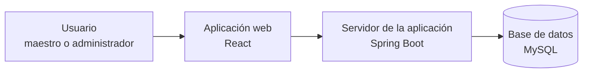
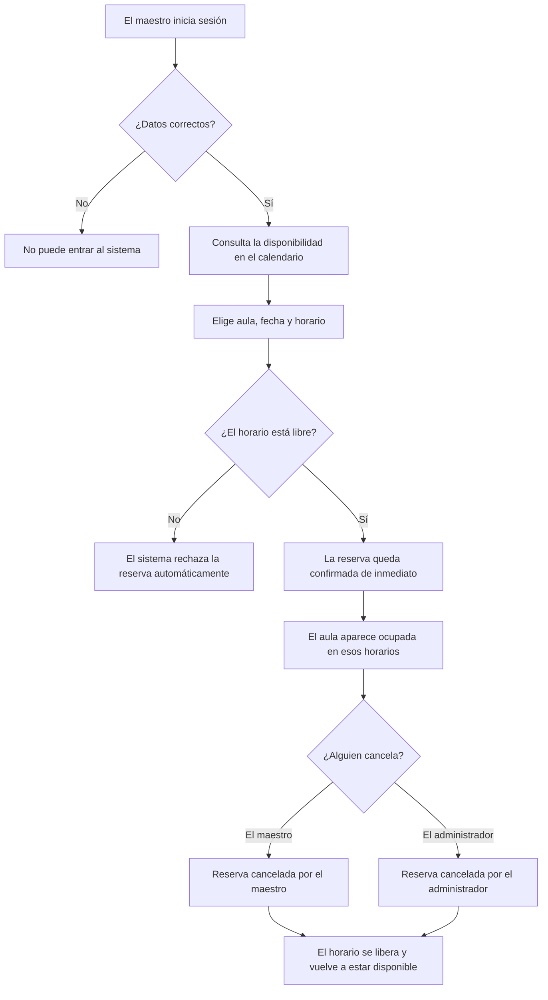

<div align="center">

# Aulas ICF

### Sistema web para la gestión y reserva de aulas del Instituto de Ciencias Físicas — UNAM

**Centraliza el registro de aulas, la reserva de espacios por parte de los maestros y la
administración de usuarios, evitando conflictos de horario y procesos manuales dispersos.**

</div>

***

## Tabla de contenido

- [Descripción](#descripción)
- [Arquitectura general](#arquitectura-general)
- [Flujo principal de una reserva](#flujo-principal-de-una-reserva)
- [Módulos del sistema](#módulos-del-sistema)
- [Roles de usuario](#roles-de-usuario)
- [Tecnologías utilizadas](#tecnologías-utilizadas)
- [Requisitos mínimos](#requisitos-mínimos)
- [Estructura del proyecto](#estructura-del-proyecto)
- [Puesta en marcha en desarrollo](#puesta-en-marcha-en-desarrollo)
- [Despliegue en producción](#despliegue-en-producción)
- [Reglas de negocio relevantes](#reglas-de-negocio-relevantes)
- [Documentación adicional](#documentación-adicional)
- [Autores](#autores)

***

## Descripción

**Aulas ICF** es un sistema web para gestionar la reserva de aulas del Instituto de Ciencias
Físicas de la UNAM. Permite a los maestros consultar la disponibilidad en calendario y
reservar directamente un aula (sin flujo de aprobación previa), y a los administradores
gestionar usuarios, aulas, recursos, semestres y reportes desde un panel dedicado.

El sistema está compuesto por dos proyectos independientes que se comunican por HTTP:

- **`back/aulas`** — API REST en Spring Boot, responsable de la lógica de negocio,
  autenticación y persistencia.
- **`front/icf-aulas`** — SPA en React que consume esa API.

***

## Arquitectura general



- **Autenticación:** JWT (access + refresh token) vía Spring Security. El backend expone
  Swagger/OpenAPI (`/swagger-ui.html`) únicamente en el perfil `dev`.
- **Persistencia:** el esquema de base de datos lo administra **Flyway** por completo —
  Hibernate nunca crea ni altera tablas, solo valida que las entidades coincidan
  (`ddl-auto=validate`).
- **Archivos:** las listas de alumnos (`.xlsx`) se almacenan en disco bajo un directorio
  configurable (`STORAGE_BASE_DIR`), gestionado por un servicio de almacenamiento propio.

***

## Flujo principal de una reserva

No existe un flujo de aprobación: una reserva queda **activa de inmediato** al crearse y
ocupa el aula desde ese momento. Solo puede transicionar de `ACTIVE` a un estado cancelado,
lo que libera los horarios reservados.



> Los nombres técnicos exactos de estos estados (`ACTIVE`, `CANCELLED_BY_USER`,
> `CANCELLED_BY_ADMIN`) están documentados en [Reglas de negocio
> relevantes](#reglas-de-negocio-relevantes).

***

## Módulos del sistema

Basado en los controladores REST reales del backend (`back/aulas/src/main/java/.../modules`):

| Módulo | Descripción |
|---|---|
| **Autenticación** (`access/auth`) | Login, refresh y logout con JWT. |
| **Usuarios** (`access/users`) | Alta, edición y desactivación de usuarios. |
| **Roles** (`access/roles`) | Catálogo de roles (`ADMIN`, `TEACHER`), solo lectura para administradores. |
| **Semestres** (`academic/semesters`) | Periodos académicos que acotan las reservas. |
| **Horarios** (`academic/timeslots`) | Catálogo de bloques horarios (30 min por defecto). |
| **Aulas** (`resources/classrooms`) | Alta, edición y activación/desactivación de aulas. |
| **Equipo/recursos** (`resources/equipment`) | Catálogo de recursos disponibles (proyectores, etc.). |
| **Asignación de recursos** (`resources/allocations`) | Vincula recursos a aulas específicas. |
| **Grupos de reserva** (`reservations/groups`) | Agrupa instancias recurrentes de una misma reserva. |
| **Instancias de reserva** (`reservations/instances`) | Reservas puntuales por fecha/aula/horario. |
| **Listas de alumnos** (`reservations/students`) | Carga y consulta de rosters `.xlsx` por grupo. |
| **Historial** (`reservations/history`) | Consulta histórica de reservas y cancelaciones. |
| **Reportes** (`reports`) | Estadísticas y exportación (PDF/Excel) de uso de aulas. |

***

## Roles de usuario

### `ADMIN`

- Registrar, editar y desactivar usuarios y aulas.
- Gestionar recursos, semestres y asignaciones de recursos a aulas.
- Cancelar cualquier reserva (`CANCELLED_BY_ADMIN`).
- Consultar reportes y el historial completo del sistema.

### `TEACHER`

- Consultar disponibilidad de aulas en calendario.
- Crear reservas (individuales o recurrentes).
- Cancelar sus propias reservas (`CANCELLED_BY_USER`).
- Subir y consultar la lista de alumnos de sus grupos.

***

## Tecnologías utilizadas

| Categoría | Tecnología | Versión |
|---|---|---|
| Backend | Spring Boot | 4.0.6 (Java 21) |
| Backend | Spring Security + JWT (`jjwt`) | 0.12.6 |
| Backend | Flyway | (gestión de esquema, MySQL) |
| Backend | MapStruct | 1.6.3 |
| Backend | springdoc-openapi (Swagger UI, solo `dev`) | 2.8.8 |
| Backend | Apache POI (lectura/escritura `.xlsx`) | 5.3.0 |
| Backend | OpenPDF (reportes en PDF) | 1.3.43 |
| Backend | Bucket4j (rate limiting) | 8.10.1 |
| Base de datos | MySQL | 5.7 / 8.x, o MariaDB compatible |
| Frontend | React | 19.2 |
| Frontend | Vite | 8.1 |
| Frontend | React Router | 7.18 |
| Frontend | TanStack Query | 5.101 |
| Frontend | Zod (validación de formularios) | 4.4 |
| Frontend | FullCalendar (calendario de disponibilidad) | 6.1 |
| Frontend | Recharts (gráficas de reportes) | 3.9 |
| Frontend | styled-components | 6.4 |
| Gestor de paquetes (front) | pnpm o npm (ambos lockfiles versionados) | — |

***

## Requisitos mínimos

Para correr el proyecto en local necesitas tener instalado:

| Componente | Versión requerida | Verificar con | Notas |
|---|---|---|---|
| **JDK** | 21 (LTS) | `java -version` | Fijado en `<java.version>` del `pom.xml`; el backend no compila contra 17 ni contra versiones posteriores a 21 sin ajustar esa propiedad. **Requiere `JAVA_HOME` apuntando a esa instalación del JDK** (no basta con tenerlo en el `PATH`): tanto `mvnw`/`mvnw.cmd` como IntelliJ lo usan para localizar el JDK. |
| **Maven** | Sin instalación aparte | `./mvnw -v` | El repositorio incluye el *wrapper* (`mvnw` / `mvnw.cmd`), que descarga la versión correcta de Maven automáticamente en la primera ejecución; sigue dependiendo de `JAVA_HOME` para saber contra qué JDK compilar. |
| **Node.js** | `^20.19.0` o `>=22.12.0` | `node -v` | Rango exigido por Vite 8. Se recomienda usar la LTS más reciente de la rama 22 (`nvm install --lts` o equivalente). |
| **pnpm o npm** (frontend) | Cualquiera de los dos | `pnpm -v` / `npm -v` | El repositorio versiona **ambos** lockfiles (`pnpm-lock.yaml` y `package-lock.json`) porque el equipo trabaja con uno u otro según la máquina. Usa siempre el mismo gestor en tu propia máquina de trabajo: alternar entre `pnpm install` y `npm install` en el mismo `node_modules` puede dejar dependencias inconsistentes. pnpm se instala con `corepack enable` (incluido en Node.js). |
| **MySQL** | 5.7+ / 8.x, o MariaDB compatible | `mysql --version` | Debe existir una base de datos vacía antes del primer arranque (ver [Base de datos](#4-base-de-datos-desarrollo)); Flyway crea el esquema completo. |
| **Git** | Cualquier versión reciente | `git --version` | — |
| **Puertos libres** | `8080` (API), `5173` (frontend en desarrollo), `3306` (MySQL por defecto) | Ver comandos por sistema operativo abajo | Si alguno está ocupado, cámbialo en `.env` (backend) o en el comando `dev` (`--port`) antes de arrancar. |

Opcional: **IntelliJ IDEA** (Community o Ultimate) para correr y depurar el backend con
un IDE — ver [Ejecutar el backend desde IntelliJ IDEA](#ejecutar-el-backend-desde-intellij-idea).

### Configurar `JAVA_HOME`

`mvnw`/`mvnw.cmd` y IntelliJ resuelven el JDK a través de `JAVA_HOME`, no del `PATH`. Verifica
que apunte a un JDK 21 y, si no existe o apunta a otra versión, configúralo según tu sistema
operativo:

**Windows (PowerShell)**

```powershell
# Verificar
echo $env:JAVA_HOME
java -version

# Configurar solo para la sesión actual
$env:JAVA_HOME = "C:\Program Files\Java\jdk-21"

# Configurar de forma persistente (requiere abrir una terminal nueva después)
setx JAVA_HOME "C:\Program Files\Java\jdk-21"
```

**Windows (cmd.exe)**

```cmd
echo %JAVA_HOME%
java -version
setx JAVA_HOME "C:\Program Files\Java\jdk-21"
```

**Linux (bash/zsh)**

```bash
# Verificar
echo $JAVA_HOME
java -version

# Ubicar el JDK instalado (Debian/Ubuntu, RHEL, etc.)
update-alternatives --list java   # o: readlink -f $(which java)

# Configurar solo para la sesión actual
export JAVA_HOME=/usr/lib/jvm/java-21-openjdk-amd64

# Configurar de forma persistente
echo 'export JAVA_HOME=/usr/lib/jvm/java-21-openjdk-amd64' >> ~/.bashrc   # o ~/.zshrc
source ~/.bashrc
```

**macOS (bash/zsh)**

```bash
# Verificar
echo $JAVA_HOME
java -version

# Ubicar el JDK instalado (requiere Xcode Command Line Tools / java_home)
/usr/libexec/java_home -V

# Configurar solo para la sesión actual
export JAVA_HOME=$(/usr/libexec/java_home -v 21)

# Configurar de forma persistente
echo 'export JAVA_HOME=$(/usr/libexec/java_home -v 21)' >> ~/.zshrc   # o ~/.bash_profile
source ~/.zshrc
```

En todos los casos, una vez exportado, confirma que `mvnw`/`mvnw.cmd` lo está usando con
`./mvnw -v` (Linux/macOS) o `.\mvnw.cmd -v` (Windows) — la salida incluye la ruta del JDK
detectado.

### Verificar puertos ocupados

| Sistema operativo | Comando |
|---|---|
| Windows (PowerShell/cmd) | `netstat -ano \| findstr <puerto>` |
| Linux | `ss -ltnp \| grep <puerto>` (o `sudo lsof -i :<puerto>`) |
| macOS | `lsof -i :<puerto>` |

***

## Estructura del proyecto

```text
Aulas_ICF/
├── back/
│   └── aulas/                      # API REST — Spring Boot (Maven)
│       ├── src/main/java/mx/unam/icf/aulas/modules/
│       │   ├── access/             # auth, users, roles
│       │   ├── academic/           # semesters, timeslots
│       │   ├── resources/          # classrooms, equipment, allocations
│       │   ├── reservations/       # groups, instances, students, history
│       │   └── reports/
│       ├── src/main/resources/
│       │   ├── application.properties        # config común (perfiles-agnóstica)
│       │   ├── application-dev.properties     # defaults de desarrollo
│       │   ├── application-prod.properties    # producción, sin defaults inseguros
│       │   └── db/migration/                  # migraciones Flyway
│       ├── docs/                   # documentación técnica de módulos backend
│       ├── .env.example
│       └── pom.xml
├── front/
│   └── icf-aulas/                  # SPA — React + Vite
│       ├── src/
│       │   ├── api/                # clientes HTTP por módulo
│       │   ├── modules/            # admin/, maestro/, shared/, public/
│       │   ├── schemas/            # esquemas Zod por dominio
│       │   ├── components/         # componentes reutilizables
│       │   └── routes/
│       ├── .env.example
│       └── package.json
└── docs/                           # documentación general del proyecto (auditorías, etc.)
```

***

## Puesta en marcha en desarrollo

Toda la configuración sensible o dependiente del entorno (credenciales de base de datos,
secreto JWT, CORS, correo, etc.) vive fuera del código fuente, en variables de entorno.
**Nunca edites `application.properties` para poner credenciales reales** — usa un archivo
`.env` local (gitignoreado) o variables de entorno del sistema operativo.

### 1. Clonar el repositorio

```bash
git clone <url-del-repositorio>
cd Aulas_ICF
```

### 2. Configurar y correr el backend

```bash
cd back/aulas
cp .env.example .env
# Edita .env: como mínimo, DB_USERNAME/DB_PASSWORD y JWT_SECRET.
```

Spring Boot carga `back/aulas/.env` automáticamente (vía `spring.config.import`, declarado
únicamente en `application-dev.properties`) cuando el proceso se ejecuta con ese directorio
como working directory. Ver todas las variables disponibles, con su propósito, en
[`back/aulas/.env.example`](back/aulas/.env.example).

> **Nunca pongas `SPRING_PROFILES_ACTIVE` dentro de `.env`.** Declarar un perfil desde un
> archivo importado vía `spring.config.import` entra en conflicto con la resolución de
> perfiles que Spring Boot ya tiene en curso y el arranque falla. El perfil se elige con una
> variable de entorno real del sistema operativo o con `--spring.profiles.active`, nunca
> desde este archivo. Si el backend deja de arrancar en local justo después de tocar el
> `.env`, esto es lo primero a revisar.

```bash
./mvnw spring-boot:run
```

Por defecto corre con el perfil `dev` (`spring.profiles.default=dev`), en el puerto `8080`,
y activa un JWT secret de desarrollo y un admin sembrado (`Admin@12345!`,
`admin@icf.unam.mx`). El esquema de base de datos lo gestiona Flyway en ambos perfiles (ver
punto 4) — Hibernate nunca crea ni altera tablas, solo valida que coincidan con las entidades
(`ddl-auto=validate`). **El admin sembrado por defecto es solo para desarrollo local** — ver
[Despliegue en producción](#despliegue-en-producción) para el flujo de producción.

Con el perfil `dev` activo, Swagger UI queda disponible en
`http://localhost:8080/swagger-ui.html`.

#### Ejecutar el backend desde IntelliJ IDEA

El repositorio ya incluye metadata de IntelliJ (`back/aulas/.idea/`), así que basta con:

1. **Abrir el proyecto**: `File → Open…` y selecciona la carpeta `back/aulas` (no la raíz del
   repositorio) — IntelliJ detecta el `pom.xml` e importa las dependencias Maven
   automáticamente.
2. Verifica que el **SDK del proyecto** sea Java 21 (`File → Project Structure → Project`).
3. Localiza la clase principal `mx.unam.icf.aulas.AulasApplication` y crea una configuración
   de ejecución (`Run → Edit Configurations… → + → Spring Boot`), apuntando a esa clase.
4. Como IntelliJ no lee el `.env` por sí solo, agrega las variables mínimas en
   **Environment variables** de esa configuración (o instala el plugin *EnvFile* y apunta al
   `.env` creado en el paso anterior): `DB_URL`, `DB_USERNAME`, `DB_PASSWORD`, `JWT_SECRET`,
   `APP_CORS_ALLOWED_ORIGINS`, `APP_FRONTEND_URL`, `MAIL_HOST`, `MAIL_PORT`, `MAIL_USERNAME`,
   `MAIL_PASSWORD`, `APP_NOTIFICATIONS_SUPER_ADMIN_EMAIL`, `STORAGE_BASE_DIR`. Sin ellas, el
   arranque en el perfil `dev` aplica sus defaults locales (ver `application-dev.properties`),
   así que el mínimo real para arrancar sin tocar nada es tener una base de datos MySQL local
   llamada `test_aulas` accesible con usuario `root` sin contraseña.
5. Corre o depura con el botón ▶ / 🐞 de esa configuración.

### 3. Configurar y correr el frontend

```bash
cd front/icf-aulas
cp .env.example .env.development
pnpm install    # o: npm install
pnpm dev        # o: npm run dev
```

El servidor de desarrollo queda disponible en `http://localhost:5173`. Ver
[`front/icf-aulas/.env.example`](front/icf-aulas/.env.example) para las variables
disponibles (`VITE_API_URL`, la URL base del backend).

### 4. Base de datos (desarrollo)

Solo necesitas crear una base de datos MySQL vacía y apuntar `DB_USERNAME`/`DB_PASSWORD` en
tu `.env` — Flyway se encarga del resto (schema + catálogos de roles/horarios) en el primer
arranque:

```sql
CREATE DATABASE test_aulas CHARACTER SET utf8mb4 COLLATE utf8mb4_unicode_ci;
```

***

## Despliegue en producción

Producción usa el perfil `prod` (`SPRING_PROFILES_ACTIVE=prod`), que difiere de `dev` en
varios puntos deliberados: Swagger/OpenAPI deshabilitado, sin admin sembrado por defecto
(debe provisionarse explícitamente), sin lazy-initialization (falla rápido en el arranque si
hay un error de wiring, en vez de ocultarlo hasta la primera petición), y sin ningún valor
por defecto en las variables sensibles — si falta una, la aplicación **no arranca**, en vez
de arrancar con una configuración insegura o a medias.

### 0. Requisitos del servidor (pre-flight)

Tres dependencias de infraestructura que viven fuera de este repositorio. Si no se cumplen,
el despliegue falla o se degrada de formas poco obvias:

1. **Versión del motor de base de datos.** Confirma con `SELECT VERSION();` antes de
   desplegar. La migración inicial (`V1__initial_schema.sql`) no fija ninguna collation
   explícita, así que funciona igual sobre MySQL 5.7, MySQL 8.x o MariaDB — la collation
   efectiva la decide el `CREATE DATABASE`:
   ```sql
   CREATE DATABASE aulas_icf CHARACTER SET utf8mb4 COLLATE utf8mb4_unicode_ci;
   ```
   `utf8mb4_unicode_ci` existe en las tres variantes. Si el servidor es MySQL 8.0+,
   `utf8mb4_0900_ai_ci` también sirve.

2. **Permisos de `STORAGE_BASE_DIR`.** El directorio raíz debe existir con permisos de
   escritura para el mismo usuario del sistema operativo que ejecuta el servicio systemd —
   la aplicación crea las subcarpetas internas automáticamente, y desde este cambio **aborta
   el arranque** si el directorio raíz existe pero no es escribible (en vez de fallar en
   silencio en la primera subida de un roster, semanas después):
   ```bash
   sudo mkdir -p /var/lib/aulas-icf/uploads
   sudo chown -R aulas:aulas /var/lib/aulas-icf
   sudo chmod 750 /var/lib/aulas-icf
   ```

3. **Cabeceras de proxy en Apache2.** Ver el punto 3 más abajo — `trust-proxy` y
   `forward-headers-strategy` dependen de que el `VirtualHost` reenvíe las cabeceras
   correctas; si el proxy real de tu servidor es otro (nginx, Caddy, un ALB), la directriz
   equivalente cambia mas la necesidad no.

### 1. Base de datos: Flyway aplica el esquema automáticamente

No hay ningún script SQL que ejecutar a mano. Con la base de datos vacía creada (paso 0.1),
Flyway corre embebido en el arranque de la aplicación y aplica, en orden:

- `V1__initial_schema.sql` — crea las 11 tablas, índices y llaves foráneas.
- `R__reference_data.sql` — garantiza que existan los roles (`ADMIN`, `TEACHER`) y los 24
  `time_slots` (07:00–19:00). Es una migración *repetible*: puede volver a ejecutarse si su
  contenido cambia, pero nunca borra filas — solo inserta/actualiza.

Los scripts SQL manuales usados antes de este esquema (incluido
`migration_v1.0__baseline.sql`) se movieron a
[`docs/legacy/`](back/aulas/docs/legacy/README.md) como registro histórico. **No los
ejecutes** — usan literales de estado en español (`ACTIVA`, `CANCELADA_POR_MAESTRO`) que ya
no existen en el código y su contenido ya está incorporado en `V1__initial_schema.sql`.

**Nunca ejecutes `flyway clean` contra la base de datos de producción** — borra todas las
tablas sin posibilidad de deshacer; no hay ningún escenario de mantenimiento normal que lo
requiera.

**Nota operativa — MySQL no tiene DDL transaccional.** `CREATE TABLE`/`ALTER TABLE` hacen
*implicit commit*; si `V1` fallara a la mitad, Flyway marca la migración como `failed` en
`flyway_schema_history` y no reintenta automáticamente. Sobre una instalación nueva sin
datos, el procedimiento de recuperación es simplemente recrear la base de datos y volver a
arrancar — es más simple y más seguro que reparar el historial a mano.

### 2. Variables de entorno

Copia [`back/aulas/.env.example`](back/aulas/.env.example) como punto de partida y define,
como mínimo: `DB_URL`/`DB_USERNAME`/`DB_PASSWORD`, un `JWT_SECRET` fuerte y único (nunca
reutilices el de desarrollo), `APP_CORS_ALLOWED_ORIGINS` (el origen público real del
frontend — solo scheme+host+puerto, sin ruta), `APP_FRONTEND_URL`, `MAIL_*`,
`APP_NOTIFICATIONS_SUPER_ADMIN_EMAIL`, y `APP_SEED_ADMIN_PASSWORD`/`APP_SEED_ADMIN_EMAIL`
para el primer arranque (ver punto 4). Cada una de estas es un placeholder sin valor por
defecto en `application.properties` — si falta alguna, la aplicación no arranca y el log de
Spring cita el nombre exacto de la variable faltante.

**El arranque en servidor no debe depender de un `.env`**: `spring.config.import` solo está
declarado en el perfil `dev` — en producción no existe ningún mecanismo para leer un `.env`,
por diseño (así un archivo traspapelado en el servidor no puede degradar el perfil activo ni
inyectar nada). En un servidor, las variables llegan por una de estas vías:

| Estrategia | Uso recomendado |
|---|---|
| A. `export` en la shell | ❌ No sobrevive a reinicios ni a `systemctl restart` — no reproducible |
| **B. systemd + `EnvironmentFile`** | ✅ **Producción.** Reproducible, permisos `640`, independiente del working directory, arranca solo en boot |
| C. `.env` vía `spring.config.import` | ✅ Solo desarrollo — nunca cargado en el perfil `prod` |

Ejemplo de unidad systemd (usa el usuario/rutas reales del servidor de ICF; ajusta si tu
despliegue usa otros), en `/etc/systemd/system/aulas-icf.service`:

```ini
[Unit]
Description=Aulas ICF Backend Service
After=network-online.target mysql.service
Wants=network-online.target

[Service]
User=aulas
WorkingDirectory=/opt/aulas-icf
Environment=SPRING_PROFILES_ACTIVE=prod
ExecStart=/usr/bin/java -Xms256m -Xmx1g -jar /opt/aulas-icf/aulas.jar
EnvironmentFile=/etc/aulas-icf/aulas.env
Restart=always
RestartSec=5s

[Install]
WantedBy=multi-user.target
```

```bash
sudo mkdir -p /etc/aulas-icf
sudo cp back/aulas/.env.example /etc/aulas-icf/aulas.env
sudo chown root:aulas /etc/aulas-icf/aulas.env
sudo chmod 640 /etc/aulas-icf/aulas.env
# Edita /etc/aulas-icf/aulas.env con los valores reales de producción.
```

El `EnvironmentFile` vive fuera de `/opt/aulas-icf` a propósito — nunca conviva con el JAR,
que no se modifica jamás: toda la configuración entra por el entorno. `-Xmx1g` (no menos):
Apache POI carga el árbol DOM completo de cada `.xlsx` de lista de alumnos en memoria al
parsearlo; con subidas concurrentes, un heap más chico arriesga `OutOfMemoryError`.
`RestartSec=5s` evita que systemd agote sus reintentos si el primer arranque falla por una
config incorrecta. `After=... mysql.service` asume MySQL corriendo en el mismo servidor (el
caso real de este despliegue) — si tu MySQL corre en otra máquina, quita `mysql.service` de
`After=`, ya que esa unidad no existiría localmente.

**Nombra el JAR de forma estable (`aulas.jar`), no con la versión de Maven
(`aulas-1.0.1-RELEASE.jar`).** El `ExecStart` y cualquier documentación de despliegue quedan
desactualizados en cada release si referencian el nombre versionado — en el paso de
despliegue, copia o simlinkea el JAR recién compilado a ese nombre fijo:

```bash
sudo cp back/aulas/target/aulas-1.0.1-RELEASE.jar /opt/aulas-icf/aulas.jar
```

#### Comandos útiles del día a día

| Acción | Comando |
|---|---|
| Ver logs en vivo | `journalctl -u aulas-icf -f` |
| Reiniciar el servicio | `sudo systemctl restart aulas-icf` |
| Detener el servicio | `sudo systemctl stop aulas-icf` |
| Ver si está corriendo | `sudo systemctl status aulas-icf` |
| Desplegar una versión nueva | `sudo systemctl stop aulas-icf` → reemplazar `/opt/aulas-icf/aulas.jar` → `sudo systemctl start aulas-icf` |

### 3. Frontend: build de producción

```bash
cd front/icf-aulas
# Confirma VITE_API_URL en .env.production antes de compilar — se hornea en el bundle.
pnpm install    # o: npm install
pnpm build      # o: npm run build
```

**Este paso bloquea el despliegue si se salta.** Vite hornea las variables `VITE_*` dentro
del bundle estático en tiempo de build — si `VITE_API_URL` queda en su valor de desarrollo
(`http://localhost:8080`), el navegador de cada visitante intentará pedir datos a su propia
máquina, no al servidor. El backend puede estar perfecto y la interfaz quedaría 100%
inoperativa. El valor correcto depende del punto de montaje (los módulos del front ya
incluyen `/api/v1` en su propio path, así que **no** es `/api`):

| Despliegue | `VITE_API_URL` | URL resultante |
|---|---|---|
| Raíz del dominio (`https://aulas.fis.unam.mx`) | *(vacío)* | `/api/v1/auth/login` |
| Subpath (`/~aulas_icf/api/` → `:8080/api/`) | `/~aulas_icf` | `/~aulas_icf/api/v1/auth/login` |

Si el despliegue es en la raíz, declara la variable vacía (`VITE_API_URL=`) — **omitirla** del
todo la deja en su default de `http://localhost:8080`.

Sirve el contenido de `dist/` con tu servidor web. `vite.config.js` usa `base: './'`
(rutas de assets relativas) a propósito, para no necesitar una constante de build distinta
por entorno — solo es válido porque todas las rutas de la SPA son de un único segmento
(`/reports`, `/users`, etc., ver `src/routes/routes.meta.js`); si en el futuro se agrega una
ruta anidada dos niveles (p. ej. `/reports/:id`), esto deja de resolver bien al refrescar y
hay que revisarlo (ver el comentario en `vite.config.js`).

El **ruteo** de React Router es un mecanismo aparte y sí necesita configurarse por entorno
si la app se publica bajo un subpath: declara `VITE_ROUTER_BASENAME` en `.env.production`
(p. ej. `VITE_ROUTER_BASENAME=/~aulas_icf`, sin `/` final), que alimenta
`<BrowserRouter basename={import.meta.env.VITE_ROUTER_BASENAME}>` en `src/main.jsx`. Sin
esto, React Router compara la URL completa del navegador (`/~aulas_icf/reports`) contra rutas
definidas como `/reports` — nunca hacen match, y la navegación bajo el subpath no funciona.
Para el despliegue en la raíz del dominio, deja `VITE_ROUTER_BASENAME` sin declarar.

La infraestructura de referencia de este despliegue es **Apache2**. Ejemplo de `VirtualHost`
para un despliegue bajo subpath, con proxy al backend y paridad de tamaño de subida con
`spring.servlet.multipart.max-request-size` (10 MB → 12582912 bytes con margen):

```apache
<VirtualHost *:443>
    ServerName www.fis.unam.mx
    LimitRequestBody 12582912

    # Apache/mod_proxy_http añade X-Forwarded-For automáticamente al usar ProxyPass — no
    # hace falta declararla. X-Forwarded-Proto SÍ hay que declararla explícitamente, o
    # Spring reconstruye los enlaces (p. ej. de restablecimiento de contraseña) con
    # esquema http:// en vez de https://.
    RequestHeader set X-Forwarded-Proto "expr=%{REQUEST_SCHEME}"

    ProxyPreserveHost On
    ProxyPass        /~aulas_icf/api/  http://127.0.0.1:8080/api/
    ProxyPassReverse /~aulas_icf/api/  http://127.0.0.1:8080/api/

    Alias /~aulas_icf /var/www/aulas_icf
    <Directory /var/www/aulas_icf>
        Require all granted
        FallbackResource /~aulas_icf/index.html
    </Directory>
</VirtualHost>
```

Requiere `a2enmod proxy proxy_http headers`.

> **Nota de sintaxis**: `RequestHeader set X "%{VAR}s"` en `mod_headers` referencia
> variables de entorno de `mod_ssl`, no variables arbitrarias — usar esa forma con
> `REQUEST_SCHEME` o `REMOTE_ADDR` produce una cadena vacía o literal. La sintaxis correcta
> en Apache 2.4 es `"expr=%{VAR}"` (evaluación `ap_expr`), como en el bloque de arriba.
>
> Sobre el spoofing de `X-Forwarded-For`: `RateLimitFilter.resolveClientIp()` ya toma el
> valor **más a la derecha** de la cabecera (el que añade el proxy de confianza, no
> falsificable por el cliente), así que la app no es vulnerable a un `X-Forwarded-For`
> inyectado por fuera. Como defensa en profundidad opcional, puede anteponerse
> `RequestHeader set X-Forwarded-For "expr=%{REMOTE_ADDR}"` para descartar cualquier
> valor inyectado antes de que `mod_proxy` anexe el real.

### 4. Primer arranque: usuario administrador

Con la base de datos vacía (Flyway crea el schema y los roles automáticamente, paso 1) y
`APP_SEED_ADMIN_PASSWORD`/`APP_SEED_ADMIN_EMAIL` definidas, `AdminSeeder` crea el primer
usuario `ADMIN` automáticamente al arrancar la aplicación (una sola vez; es idempotente).

**Si esas variables faltan (o la contraseña tiene menos de 12 caracteres) en un arranque
contra una base de datos sin ningún `ADMIN`, la aplicación aborta el arranque** — no queda
"funcionando" sin que nadie pueda entrar. Para arrancar deliberadamente sin sembrar un admin
(p. ej. restaurando desde un backup que ya trae usuarios), usa `APP_SEED_ADMIN_ENABLED=false`.

**Tras iniciar sesión exitosamente, retira esas dos variables** de
`/etc/aulas-icf/aulas.env` — dejarlas no aporta nada a partir de ese momento (el seeder ya no
las vuelve a leer una vez que existe un `ADMIN`) y mantener una contraseña en texto plano en
el servidor es riesgo sin contrapartida:

```bash
sudo sed -i '/^APP_SEED_ADMIN_PASSWORD=/d;/^APP_SEED_ADMIN_EMAIL=/d' /etc/aulas-icf/aulas.env
sudo systemctl restart aulas-icf
```

El reinicio de paso confirma que la aplicación arranca sin ellas.

***

## Reglas de negocio relevantes

- No se permiten reservas duplicadas para la misma aula, fecha y horario (restricción
  `UNIQUE` a nivel de base de datos, no solo validación de aplicación).
- Una reserva queda **activa desde su creación** — no existe estado pendiente ni flujo de
  aprobación.
- Solo el propio maestro dueño de la reserva, o un administrador, pueden cancelarla; el
  estado resultante distingue quién canceló (`CANCELLED_BY_USER` / `CANCELLED_BY_ADMIN`).
- Cancelar una reserva libera físicamente los horarios ocupados, permitiendo que el aula
  vuelva a reservarse en esos mismos bloques.
- Solo el administrador puede registrar, editar y desactivar usuarios y aulas.
- El cierre de sesión invalida el token de autenticación (blacklist en memoria).
- Los usuarios desactivados no pueden iniciar sesión.
- Toda reserva queda asociada a un usuario y a un aula existentes.

***

## Documentación adicional

- [`back/aulas/docs/`](back/aulas/docs) — guías técnicas por módulo backend (paginación,
  historial de reservas, reasignación, reportes, endpoints consumidos por el frontend).
- [`docs/security-audit.md`](docs/security-audit.md) — auditoría de seguridad del proyecto.
- [`back/aulas/docs/legacy/`](back/aulas/docs/legacy) — scripts SQL históricos, solo como
  referencia (no ejecutar en instalaciones nuevas).

***

## Autores

**Erick Arteaga Hernández y Daniel Emiliano Hernández Arroyo**
Proyecto de estadías profesionales
Instituto de Ciencias Físicas — UNAM
