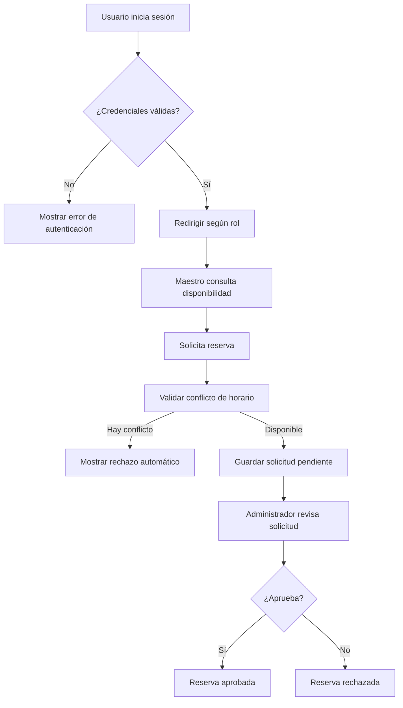

<div align="center">

# Aulas ICF
### Sistema web para la gestión y reserva de aulas del Instituto de Ciencias Físicas


**Proyecto académico enfocado en optimizar la administración, consulta de disponibilidad y reserva de aulas dentro del ICF-UNAM.**

</div>

***

## Tabla de contenido

- [Descripción](#descripción)
- [Objetivo](#objetivo)
- [Problema que resuelve](#problema-que-resuelve)
- [Características principales](#características-principales)
- [Módulos del sistema](#módulos-del-sistema)
- [Tecnologías utilizadas](#tecnologías-utilizadas)
- [Arquitectura general](#arquitectura-general)
- [Flujo principal](#flujo-principal)
- [Estructura sugerida del proyecto](#estructura-sugerida-del-proyecto)
- [Instalación y ejecución](#instalación-y-ejecución)
- [Despliegue en producción](#despliegue-en-producción)
- [Roles de usuario](#roles-de-usuario)
- [Reglas de negocio relevantes](#reglas-de-negocio-relevantes)
- [Pantallas consideradas](#pantallas-consideradas)
- [Roadmap](#roadmap)
- [Autor](#autor)

***

## Descripción

**Aulas ICF** es un sistema web diseñado para gestionar el proceso de reserva de aulas dentro del Instituto de Ciencias Físicas de la UNAM.

El sistema centraliza la consulta de disponibilidad, el registro de aulas, la administración de usuarios y la aprobación o rechazo de solicitudes, evitando conflictos de horario, duplicidad de reservas y procesos manuales poco eficientes.

***

## Objetivo

Desarrollar una plataforma web que permita al personal autorizado del ICF consultar, solicitar, administrar y controlar las reservaciones de aulas de forma rápida, segura y centralizada.

***

## Problema que resuelve

Actualmente, la gestión manual de aulas puede generar problemas como:

- Doble asignación de espacios.
- Falta de visibilidad sobre la disponibilidad real.
- Dificultad para dar seguimiento a solicitudes.
- Procesos administrativos lentos y dispersos.
- Falta de historial y trazabilidad de reservas.

**Aulas ICF** busca resolver estos problemas mediante una solución digital con control de acceso por roles, validación de conflictos y consulta en tiempo real.

***

## Características principales

- Inicio de sesión seguro con autenticación.
- Registro y administración de usuarios.
- Gestión de aulas disponibles.
- Solicitud de reservas por parte de maestros.
- Aprobación o rechazo de solicitudes por parte del administrador.
- Consulta de disponibilidad en calendario.
- Cancelación de reservas.
- Historial y seguimiento de movimientos.
- Notificaciones por correo electrónico.
- Validación para evitar conflictos de horario.

***

## Módulos del sistema

| Módulo | Descripción | Prioridad |
|---|---|---|
| **1. Autenticación y Gestión de Sesión** | Permite iniciar sesión, cerrar sesión y registrar usuarios. | Alta |
| **2. Gestión de Aulas** | Permite registrar y editar la información de las aulas disponibles. | Alta |
| **3. Gestión de Usuarios** | Permite editar y desactivar usuarios del sistema. | Media |
| **4. Reserva de Aulas** | Permite solicitar, cancelar, aprobar o rechazar reservas. | Alta |
| **5. Consulta de Disponibilidad** | Permite visualizar la disponibilidad de aulas por fecha y horario. | Alta |

***

## Tecnologías utilizadas

| Categoría | Tecnología | Uso dentro del proyecto |
|---|---|---|
| Frontend | **React** | Construcción de interfaces reutilizables e interactivas |
| Backend | **Spring Boot** | Desarrollo de la lógica del servidor y API REST |
| Base de datos | **MySQL** | Almacenamiento de usuarios, aulas y reservas |
| Seguridad | **JWT / Spring Security** | Autenticación y control de acceso |
| API | **REST** | Comunicación entre frontend y backend |
| Gestión del proyecto | **Scrum** | Organización del desarrollo por iteraciones |
| Correo | **Mail Sender** | Envío de notificaciones automáticas |

***

## Arquitectura general

```text
[ Usuario ]
    |
    v
[ Frontend - React ]
    |
    v
[ API REST - Spring Boot ]
    |
    v
[ Base de datos - MySQL ]
```

### Enfoque arquitectónico

- **Capa de presentación:** interfaz web para administradores y maestros.
- **Capa de negocio:** reglas de validación, reservas, autenticación y permisos.
- **Capa de persistencia:** almacenamiento de usuarios, aulas, solicitudes y estados.

***

## Flujo principal



***

## Estructura sugerida del proyecto

```bash
Aulas-ICF/
├── frontend/
│   ├── src/
│   ├── public/
│   └── package.json
├── backend/
│   ├── src/main/java/
│   ├── src/main/resources/
│   └── pom.xml
├── database/
│   └── aulas_icf.sql
├── docs/
│   ├── DFR.pdf
│   ├── marco-teorico.pdf
│   └── mockups/
└── README.md
```

***

## Instalación y ejecución

Toda la configuración sensible o dependiente del entorno (credenciales de base de datos,
secreto JWT, CORS, correo, etc.) vive fuera del código fuente, en variables de entorno.
**Nunca edites `application.properties` para poner credenciales reales** — usa un archivo
`.env` local (gitignoreado) o variables de entorno del sistema operativo.

### 1. Clonar el repositorio

```bash
git clone <url-del-repositorio>
cd Aulas_ICF
```

### 2. Configurar el backend

```bash
cd back/aulas
cp .env.example .env
# Edita .env: como mínimo, DB_USERNAME/DB_PASSWORD y JWT_SECRET.
```

Spring Boot carga `back/aulas/.env` automáticamente (vía `spring.config.import`, declarado
únicamente en `application-dev.properties`) cuando el proceso se ejecuta con ese directorio
como working directory. Ver todas las variables disponibles, con su propósito, en
[`back/aulas/.env.example`](back/aulas/.env.example).

> **Nunca pongas `SPRING_PROFILES_ACTIVE` dentro de `.env`.** Declarar un perfil desde un
> archivo importado vía `spring.config.import` entra en conflicto con la resolución de
> perfiles que Spring Boot ya tiene en curso y el arranque falla. El perfil se elige con una
> variable de entorno real del sistema operativo o con `--spring.profiles.active`, nunca
> desde este archivo. Si el backend deja de arrancar en local justo después de tocar el
> `.env`, esto es lo primero a revisar.

```bash
./mvnw spring-boot:run
```

Por defecto corre con el perfil `dev` (`spring.profiles.default=dev`), que activa un JWT
secret de desarrollo y un admin sembrado (`Admin@12345!`, `admin@icf.unam.mx`). El esquema
de base de datos lo gestiona Flyway en ambos perfiles (ver punto 4) — Hibernate nunca crea
ni altera tablas, solo valida que coincidan con las entidades (`ddl-auto=validate`).
**El admin sembrado por defecto es solo para desarrollo local** — ver
[Despliegue en producción](#despliegue-en-producción) para el flujo de producción.

### 3. Configurar el frontend

```bash
cd front/icf-aulas
cp .env.example .env.development
pnpm install
pnpm dev
```

> El proyecto usa **pnpm**, no npm — `pnpm-lock.yaml` está versionado para builds
> reproducibles. Ver [`front/icf-aulas/.env.example`](front/icf-aulas/.env.example) para las
> variables disponibles (`VITE_API_URL`, la URL base del backend).

### 4. Base de datos (desarrollo)

Solo necesitas crear una base de datos MySQL vacía y apuntar `DB_USERNAME`/`DB_PASSWORD` en
tu `.env` — Flyway se encarga del resto (schema + catálogos de roles/horarios) en el primer
arranque:

```sql
CREATE DATABASE test_aulas CHARACTER SET utf8mb4 COLLATE utf8mb4_unicode_ci;
```

***

## Despliegue en producción

Producción usa el perfil `prod` (`SPRING_PROFILES_ACTIVE=prod`), que difiere de `dev` en
varios puntos deliberados: Swagger/OpenAPI deshabilitado, sin admin sembrado por defecto
(debe provisionarse explícitamente), sin lazy-initialization (falla rápido en el arranque si
hay un error de wiring, en vez de ocultarlo hasta la primera petición), y sin ningún valor
por defecto en las variables sensibles — si falta una, la aplicación **no arranca**, en vez
de arrancar con una configuración insegura o a medias.

### 0. Requisitos del servidor (pre-flight)

Tres dependencias de infraestructura que viven fuera de este repositorio. Si no se cumplen,
el despliegue falla o se degrada de formas poco obvias:

1. **Versión del motor de base de datos.** Confirma con `SELECT VERSION();` antes de
   desplegar. La migración inicial (`V1__initial_schema.sql`) no fija ninguna collation
   explícita, así que funciona igual sobre MySQL 5.7, MySQL 8.x o MariaDB — la collation
   efectiva la decide el `CREATE DATABASE`:
   ```sql
   CREATE DATABASE aulas_icf CHARACTER SET utf8mb4 COLLATE utf8mb4_unicode_ci;
   ```
   `utf8mb4_unicode_ci` existe en las tres variantes. Si el servidor es MySQL 8.0+,
   `utf8mb4_0900_ai_ci` también sirve.

2. **Permisos de `STORAGE_BASE_DIR`.** El directorio raíz debe existir con permisos de
   escritura para el mismo usuario del sistema operativo que ejecuta el servicio systemd —
   la aplicación crea las subcarpetas internas automáticamente, y desde este cambio **aborta
   el arranque** si el directorio raíz existe pero no es escribible (en vez de fallar en
   silencio en la primera subida de un roster, semanas después):
   ```bash
   sudo mkdir -p /var/lib/aulas-icf/uploads
   sudo chown -R aulasuser:aulasuser /var/lib/aulas-icf
   sudo chmod 750 /var/lib/aulas-icf
   ```

3. **Cabeceras de proxy en Apache2.** Ver el punto 3 más abajo — `trust-proxy` y
   `forward-headers-strategy` dependen de que el `VirtualHost` reenvíe las cabeceras
   correctas; si el proxy real de tu servidor es otro (nginx, Caddy, un ALB), la directriz
   equivalente cambia mas la necesidad no.

### 1. Base de datos: Flyway aplica el esquema automáticamente

A diferencia de versiones anteriores de este proyecto, **no hay ningún script SQL que
ejecutar a mano**. Con la base de datos vacía creada (paso 0.1), Flyway corre embebido en el
arranque de la aplicación y aplica, en orden:

- `V1__initial_schema.sql` — crea las 11 tablas, índices y llaves foráneas.
- `R__reference_data.sql` — garantiza que existan los roles (`ADMIN`, `TEACHER`) y los 24
  `time_slots` (07:00–19:00). Es una migración *repetible*: puede volver a ejecutarse si su
  contenido cambia, pero nunca borra filas — solo inserta/actualiza.

Los scripts SQL manuales usados antes de este cambio (incluido
`migration_v1.0__baseline.sql`) se movieron a
[`docs/legacy/`](docs/legacy/README.md) como registro histórico. **No los ejecutes** —
usan literales de estado en español (`ACTIVA`, `CANCELADA_POR_MAESTRO`) que ya no existen en
el código y su contenido ya está incorporado en `V1__initial_schema.sql`.

**Nota operativa — MySQL no tiene DDL transaccional.** `CREATE TABLE`/`ALTER TABLE` hacen
*implicit commit*; si `V1` fallara a la mitad, Flyway marca la migración como `failed` en
`flyway_schema_history` y no reintenta automáticamente. Sobre una instalación nueva sin
datos, el procedimiento de recuperación es simplemente recrear la base de datos y volver a
arrancar — es más simple y más seguro que reparar el historial a mano.

### 2. Variables de entorno

Copia [`back/aulas/.env.example`](back/aulas/.env.example) como punto de partida y define,
como mínimo: `DB_URL`/`DB_USERNAME`/`DB_PASSWORD`, un `JWT_SECRET` fuerte y único (nunca
reutilices el de desarrollo), `APP_CORS_ALLOWED_ORIGINS` (el origen público real del
frontend — solo scheme+host+puerto, sin ruta), `APP_FRONTEND_URL`, `MAIL_*`,
`APP_NOTIFICATIONS_SUPER_ADMIN_EMAIL`, y `APP_SEED_ADMIN_PASSWORD`/`APP_SEED_ADMIN_EMAIL`
para el primer arranque (ver punto 4). Cada una de estas es un placeholder sin valor por
defecto en `application.properties` — si falta alguna, la aplicación no arranca y el log de
Spring cita el nombre exacto de la variable faltante.

**El arranque en servidor no debe depender de un `.env`**: `spring.config.import` solo está
declarado en el perfil `dev` — en producción no existe ningún mecanismo para leer un `.env`,
por diseño (así un archivo traspapelado en el servidor no puede degradar el perfil activo ni
inyectar nada). En un servidor, las variables llegan por una de estas vías:

| Estrategia | Uso recomendado |
|---|---|
| A. `export` en la shell | ❌ No sobrevive a reinicios ni a `systemctl restart` — no reproducible |
| **B. systemd + `EnvironmentFile`** | ✅ **Producción.** Reproducible, permisos `640`, independiente del working directory, arranca solo en boot |
| C. `.env` vía `spring.config.import` | ✅ Solo desarrollo — nunca cargado en el perfil `prod` |

Ejemplo de unidad systemd (ajusta rutas, usuario y tamaño de heap al servidor real):

```ini
[Unit]
Description=Aulas ICF Backend Service
After=network-online.target
Wants=network-online.target

[Service]
User=aulasuser
WorkingDirectory=/opt/aulas
Environment=SPRING_PROFILES_ACTIVE=prod
ExecStart=/usr/bin/java -Xms256m -Xmx1g -jar /opt/aulas/aulas-backend.jar
EnvironmentFile=/etc/aulas/aulas.env
Restart=always
RestartSec=5s

[Install]
WantedBy=multi-user.target
```

```bash
sudo mkdir -p /etc/aulas
sudo cp back/aulas/.env.example /etc/aulas/aulas.env
sudo chown root:aulasuser /etc/aulas/aulas.env
sudo chmod 640 /etc/aulas/aulas.env
# Edita /etc/aulas/aulas.env con los valores reales de producción.
```

El `EnvironmentFile` vive fuera de `/opt/aulas` a propósito — nunca conviva con el JAR, que
no se modifica jamás: toda la configuración entra por el entorno. `-Xmx1g` (no menos): Apache
POI carga el árbol DOM completo de cada `.xlsx` de lista de alumnos en memoria al parsearlo;
con subidas concurrentes, un heap más chico arriesga `OutOfMemoryError`. `RestartSec=5s` evita
que systemd agote sus reintentos si el primer arranque falla por una config incorrecta.
`After=network-online.target` (no `mysql.service`): si MySQL corre en otra máquina, esa
unidad no existe localmente.

### 3. Frontend: build de producción

```bash
cd front/icf-aulas
# Confirma VITE_API_URL en .env.production antes de compilar — se hornea en el bundle.
pnpm install
pnpm build
```

**Este paso bloquea el despliegue si se salta.** Vite hornea las variables `VITE_*` dentro
del bundle estático en tiempo de build — si `VITE_API_URL` queda en su valor de desarrollo
(`http://localhost:8080`), el navegador de cada visitante intentará pedir datos a su propia
máquina, no al servidor. El backend puede estar perfecto y la interfaz quedaría 100%
inoperativa. El valor correcto depende del punto de montaje (los módulos del front ya
incluyen `/api/v1` en su propio path, así que **no** es `/api`):

| Despliegue | `VITE_API_URL` | URL resultante |
|---|---|---|
| Raíz del dominio (`https://aulas.fis.unam.mx`) | *(vacío)* | `/api/v1/auth/login` |
| Subpath (`/salasicf/api/` → `:8080/api/`) | `/salasicf` | `/salasicf/api/v1/auth/login` |

Si el despliegue es en la raíz, declara la variable vacía (`VITE_API_URL=`) — **omitirla** del
todo la deja en su default de `http://localhost:8080`.

Sirve el contenido de `dist/` con tu servidor web. Si la aplicación se publica bajo un
subpath (p. ej. `/salasicf/`) en vez de la raíz del dominio, además necesitas:
`base: '/salasicf/'` en `vite.config.js` y `<BrowserRouter basename={import.meta.env.BASE_URL}>`
en `src/main.jsx` — sin esto, los assets se piden fuera del proxy y la SPA muestra 404/pantalla
en blanco al refrescar subrutas.

La infraestructura de referencia de este despliegue es **Apache2**. Ejemplo de `VirtualHost`
para un despliegue bajo subpath, con proxy al backend y paridad de tamaño de subida con
`spring.servlet.multipart.max-request-size` (10 MB → 12582912 bytes con margen):

```apache
<VirtualHost *:443>
    ServerName www.fis.unam.mx
    LimitRequestBody 12582912

    # Apache/mod_proxy_http añade X-Forwarded-For automáticamente al usar ProxyPass — no
    # hace falta declararla. X-Forwarded-Proto SÍ hay que declararla explícitamente, o
    # Spring reconstruye los enlaces (p. ej. de restablecimiento de contraseña) con
    # esquema http:// en vez de https://.
    RequestHeader set X-Forwarded-Proto "expr=%{REQUEST_SCHEME}"

    ProxyPreserveHost On
    ProxyPass        /salasicf/api/  http://127.0.0.1:8080/api/
    ProxyPassReverse /salasicf/api/  http://127.0.0.1:8080/api/

    Alias /salasicf /var/www/salasicf
    <Directory /var/www/salasicf>
        Require all granted
        FallbackResource /salasicf/index.html
    </Directory>
</VirtualHost>
```

Requiere `a2enmod proxy proxy_http headers`.

> **Nota de sintaxis**: `RequestHeader set X "%{VAR}s"` en `mod_headers` referencia
> variables de entorno de `mod_ssl`, no variables arbitrarias — usar esa forma con
> `REQUEST_SCHEME` o `REMOTE_ADDR` produce una cadena vacía o literal. La sintaxis correcta
> en Apache 2.4 es `"expr=%{VAR}"` (evaluación `ap_expr`), como en el bloque de arriba.
>
> Sobre el spoofing de `X-Forwarded-For`: `RateLimitFilter.resolveClientIp()` ya toma el
> valor **más a la derecha** de la cabecera (el que añade el proxy de confianza, no
> falsificable por el cliente), así que la app no es vulnerable a un `X-Forwarded-For`
> inyectado por fuera. Como defensa en profundidad opcional, puede anteponerse
> `RequestHeader set X-Forwarded-For "expr=%{REMOTE_ADDR}"` para descartar cualquier
> valor inyectado antes de que `mod_proxy` anexe el real.

### 4. Primer arranque: usuario administrador

Con la base de datos vacía (Flyway crea el schema y los roles automáticamente, paso 1) y
`APP_SEED_ADMIN_PASSWORD`/`APP_SEED_ADMIN_EMAIL` definidas, `AdminSeeder` crea el primer
usuario `ADMIN` automáticamente al arrancar la aplicación (una sola vez; es idempotente).

**Si esas variables faltan (o la contraseña tiene menos de 12 caracteres) en un arranque
contra una base de datos sin ningún `ADMIN`, la aplicación aborta el arranque** — no queda
"funcionando" sin que nadie pueda entrar. Para arrancar deliberadamente sin sembrar un admin
(p. ej. restaurando desde un backup que ya trae usuarios), usa `APP_SEED_ADMIN_ENABLED=false`.

**Tras iniciar sesión exitosamente, retira esas dos variables** de
`/etc/aulas/aulas.env` — dejarlas no aporta nada a partir de ese momento (el seeder ya no
las vuelve a leer una vez que existe un `ADMIN`) y mantener una contraseña en texto plano en
el servidor es riesgo sin contrapartida:

```bash
sudo sed -i '/^APP_SEED_ADMIN_PASSWORD=/d;/^APP_SEED_ADMIN_EMAIL=/d' /etc/aulas/aulas.env
sudo systemctl restart aulas
```

El reinicio de paso confirma que la aplicación arranca sin ellas.

***

## Roles de usuario

### Administrador

- Registrar usuarios.
- Editar usuarios.
- Desactivar usuarios.
- Registrar aulas.
- Editar aulas.
- Aprobar o rechazar solicitudes.
- Consultar información general del sistema.

### Maestro

- Iniciar sesión.
- Consultar disponibilidad de aulas.
- Solicitar reserva.
- Cancelar sus propias reservas.
- Consultar el estado de sus solicitudes.

***

## Reglas de negocio relevantes

- No se deben permitir reservas duplicadas para la misma aula, fecha y horario.
- Solo el administrador puede registrar y gestionar usuarios.
- Solo el administrador puede aprobar o rechazar solicitudes pendientes.
- El cierre de sesión debe invalidar el token de autenticación.
- No se debe permitir regresar a pantallas protegidas después de cerrar sesión.
- Los usuarios desactivados no podrán acceder al sistema.
- Toda reserva debe quedar asociada a un usuario y a un aula existente.

***

## Pantallas consideradas

### Compartidas
- Login
- Perfil de usuario
- Cerrar sesión

### Administrador
- Dashboard principal
- Gestión de usuarios
- Registro de usuario
- Gestión de aulas
- Registro y edición de aula
- Solicitudes pendientes
- Historial de reservas

### Maestro
- Calendario de disponibilidad
- Solicitar reserva
- Mis reservas
- Detalle de reserva

### Estados especiales
- 401 No autenticado
- 403 Sin permisos
- 404 Página no encontrada
- 500 Error del servidor
- Pantallas vacías
- Pantalla sin conexión

***

## Roadmap

- [x] Definición del problema
- [x] Levantamiento de requerimientos funcionales
- [x] Diseño del marco teórico
- [x] Definición de módulos del sistema
- [x] Diseño de interfaces iniciales
- [ ] Implementación del frontend
- [ ] Implementación del backend
- [ ] Integración con base de datos
- [ ] Pruebas funcionales
- [ ] Despliegue inicial

***

## Autores

**Erick Arteaga Hernández y Daniel Emiliano Hernández Arroyo**  
Proyecto académico / Estadías  
Instituto de Ciencias Físicas - UNAM

***

## Nota

Este repositorio forma parte de un proyecto académico. Su finalidad es documentar y desarrollar una propuesta de sistema web para la administración y reserva de aulas dentro del ICF.
