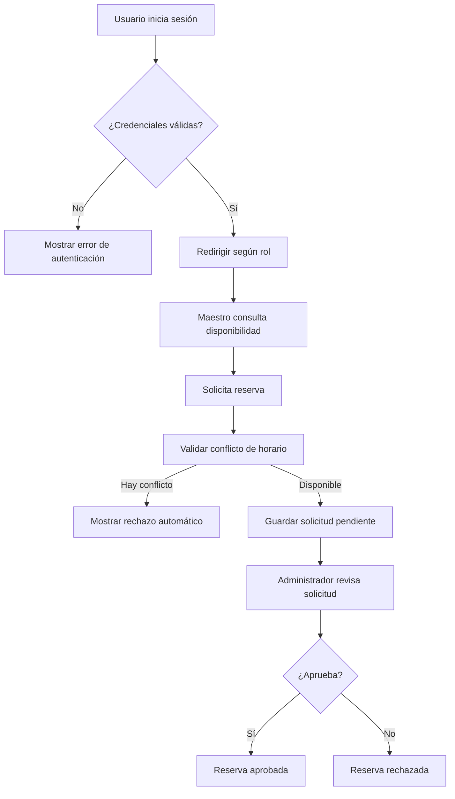

<div align="center">

# Aulas ICF
### Sistema web para la gestión y reserva de aulas del Instituto de Ciencias Físicas


**Proyecto académico enfocado en optimizar la administración, consulta de disponibilidad y reserva de aulas dentro del ICF-UNAM.**

</div>

***

## Tabla de contenido

- [Descripción](#descripción)
- [Objetivo](#objetivo)
- [Problema que resuelve](#problema-que-resuelve)
- [Características principales](#características-principales)
- [Módulos del sistema](#módulos-del-sistema)
- [Tecnologías utilizadas](#tecnologías-utilizadas)
- [Arquitectura general](#arquitectura-general)
- [Flujo principal](#flujo-principal)
- [Estructura sugerida del proyecto](#estructura-sugerida-del-proyecto)
- [Instalación y ejecución](#instalación-y-ejecución)
- [Roles de usuario](#roles-de-usuario)
- [Reglas de negocio relevantes](#reglas-de-negocio-relevantes)
- [Pantallas consideradas](#pantallas-consideradas)
- [Roadmap](#roadmap)
- [Autor](#autor)

***

## Descripción

**Aulas ICF** es un sistema web diseñado para gestionar el proceso de reserva de aulas dentro del Instituto de Ciencias Físicas de la UNAM.

El sistema centraliza la consulta de disponibilidad, el registro de aulas, la administración de usuarios y la aprobación o rechazo de solicitudes, evitando conflictos de horario, duplicidad de reservas y procesos manuales poco eficientes.

***

## Objetivo

Desarrollar una plataforma web que permita al personal autorizado del ICF consultar, solicitar, administrar y controlar las reservaciones de aulas de forma rápida, segura y centralizada.

***

## Problema que resuelve

Actualmente, la gestión manual de aulas puede generar problemas como:

- Doble asignación de espacios.
- Falta de visibilidad sobre la disponibilidad real.
- Dificultad para dar seguimiento a solicitudes.
- Procesos administrativos lentos y dispersos.
- Falta de historial y trazabilidad de reservas.

**Aulas ICF** busca resolver estos problemas mediante una solución digital con control de acceso por roles, validación de conflictos y consulta en tiempo real.

***

## Características principales

- Inicio de sesión seguro con autenticación.
- Registro y administración de usuarios.
- Gestión de aulas disponibles.
- Solicitud de reservas por parte de maestros.
- Aprobación o rechazo de solicitudes por parte del administrador.
- Consulta de disponibilidad en calendario.
- Cancelación de reservas.
- Historial y seguimiento de movimientos.
- Notificaciones por correo electrónico.
- Validación para evitar conflictos de horario.

***

## Módulos del sistema

| Módulo | Descripción | Prioridad |
|---|---|---|
| **1. Autenticación y Gestión de Sesión** | Permite iniciar sesión, cerrar sesión y registrar usuarios. | Alta |
| **2. Gestión de Aulas** | Permite registrar y editar la información de las aulas disponibles. | Alta |
| **3. Gestión de Usuarios** | Permite editar y desactivar usuarios del sistema. | Media |
| **4. Reserva de Aulas** | Permite solicitar, cancelar, aprobar o rechazar reservas. | Alta |
| **5. Consulta de Disponibilidad** | Permite visualizar la disponibilidad de aulas por fecha y horario. | Alta |

***

## Tecnologías utilizadas

| Categoría | Tecnología | Uso dentro del proyecto |
|---|---|---|
| Frontend | **React** | Construcción de interfaces reutilizables e interactivas |
| Backend | **Spring Boot** | Desarrollo de la lógica del servidor y API REST |
| Base de datos | **MySQL** | Almacenamiento de usuarios, aulas y reservas |
| Seguridad | **JWT / Spring Security** | Autenticación y control de acceso |
| API | **REST** | Comunicación entre frontend y backend |
| Gestión del proyecto | **Scrum** | Organización del desarrollo por iteraciones |
| Correo | **Mail Sender** | Envío de notificaciones automáticas |

***

## Arquitectura general

```text
[ Usuario ]
    |
    v
[ Frontend - React ]
    |
    v
[ API REST - Spring Boot ]
    |
    v
[ Base de datos - MySQL ]
```

### Enfoque arquitectónico

- **Capa de presentación:** interfaz web para administradores y maestros.
- **Capa de negocio:** reglas de validación, reservas, autenticación y permisos.
- **Capa de persistencia:** almacenamiento de usuarios, aulas, solicitudes y estados.

***

## Flujo principal



***

## Estructura sugerida del proyecto

```bash
Aulas-ICF/
├── frontend/
│   ├── src/
│   ├── public/
│   └── package.json
├── backend/
│   ├── src/main/java/
│   ├── src/main/resources/
│   └── pom.xml
├── database/
│   └── aulas_icf.sql
├── docs/
│   ├── DFR.pdf
│   ├── marco-teorico.pdf
│   └── mockups/
└── README.md
```

***

## Instalación y ejecución

### 1. Clonar el repositorio

```bash
git clone https://github.com/tu-usuario/aulas-icf.git
cd aulas-icf
```

### 2. Configurar el frontend

```bash
cd frontend
npm install
npm run dev
```

### 3. Configurar el backend

```bash
cd backend
./mvnw spring-boot:run
```

### 4. Configurar la base de datos

- Crear una base de datos en MySQL.
- Importar el script SQL inicial.
- Configurar las credenciales en `application.properties`.

Ejemplo:

```properties
spring.datasource.url=jdbc:mysql://localhost:3306/aulas_icf
spring.datasource.username=root
spring.datasource.password=tu_password
spring.jpa.hibernate.ddl-auto=update
```

***

## Roles de usuario

### Administrador

- Registrar usuarios.
- Editar usuarios.
- Desactivar usuarios.
- Registrar aulas.
- Editar aulas.
- Aprobar o rechazar solicitudes.
- Consultar información general del sistema.

### Maestro

- Iniciar sesión.
- Consultar disponibilidad de aulas.
- Solicitar reserva.
- Cancelar sus propias reservas.
- Consultar el estado de sus solicitudes.

***

## Reglas de negocio relevantes

- No se deben permitir reservas duplicadas para la misma aula, fecha y horario.
- Solo el administrador puede registrar y gestionar usuarios.
- Solo el administrador puede aprobar o rechazar solicitudes pendientes.
- El cierre de sesión debe invalidar el token de autenticación.
- No se debe permitir regresar a pantallas protegidas después de cerrar sesión.
- Los usuarios desactivados no podrán acceder al sistema.
- Toda reserva debe quedar asociada a un usuario y a un aula existente.

***

## Pantallas consideradas

### Compartidas
- Login
- Perfil de usuario
- Cerrar sesión

### Administrador
- Dashboard principal
- Gestión de usuarios
- Registro de usuario
- Gestión de aulas
- Registro y edición de aula
- Solicitudes pendientes
- Historial de reservas

### Maestro
- Calendario de disponibilidad
- Solicitar reserva
- Mis reservas
- Detalle de reserva

### Estados especiales
- 401 No autenticado
- 403 Sin permisos
- 404 Página no encontrada
- 500 Error del servidor
- Pantallas vacías
- Pantalla sin conexión

***

## Roadmap

- [x] Definición del problema
- [x] Levantamiento de requerimientos funcionales
- [x] Diseño del marco teórico
- [x] Definición de módulos del sistema
- [x] Diseño de interfaces iniciales
- [ ] Implementación del frontend
- [ ] Implementación del backend
- [ ] Integración con base de datos
- [ ] Pruebas funcionales
- [ ] Despliegue inicial

***

## Autores

**Erick Arteaga Hernández y Daniel Emiliano Hernández Arroyo**  
Proyecto académico / Estadías  
Instituto de Ciencias Físicas - UNAM

***

## Nota

Este repositorio forma parte de un proyecto académico. Su finalidad es documentar y desarrollar una propuesta de sistema web para la administración y reserva de aulas dentro del ICF.
